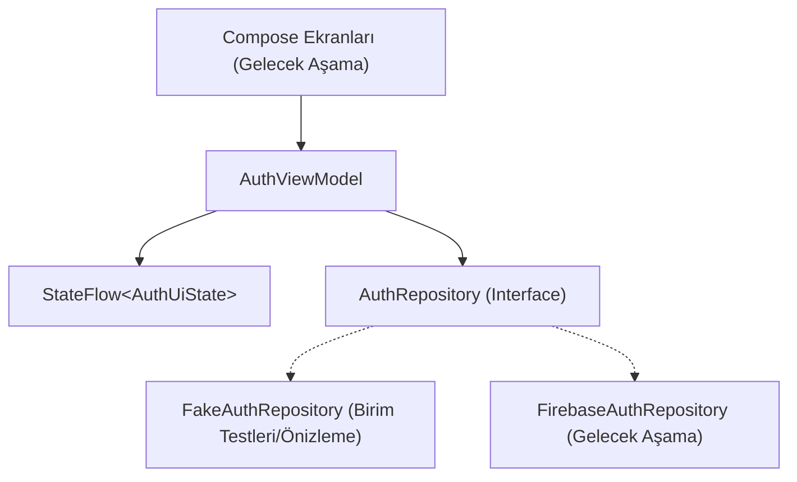

# Android Kimlik Doğrulama Temeli (Auth Foundation) Uygulama Planı

## Hedef Açıklaması
**Developer 2** olarak, Developer 1'in devam eden çalışmalarından (Template Detail, yerel kurulum, kütüphane entegrasyonu) tamamen izole bir şekilde Kare uygulamasının yerel Android kimlik doğrulama temelini (Authentication Foundation) hayata geçirmek.

Bu aşamada henüz gerçek Firebase SDK entegrasyonu yapılmadan Domain, Repository kontratı, ViewModel ve testler için in-memory sahte (fake) repository hazırlanacaktır. Tüm işlevsel davranışlar, iOS uygulamasındaki (`semra2314/Atalarin-Sozu` deposu, `IOS` dalı, özellikle `AuthService.swift`) mantıktan türetilecek ve doğrudan Swift çevirisi yerine modern Android/Kotlin mimarisine (`UI -> ViewModel -> Repository -> Data Source`) uyarlanacaktır.

---

## Dikkat Edilmesi Gereken Kritik Noktalar

> [!IMPORTANT]
> **Katı İş Birliği ve İzolasyon Sınırları**:
> Developer 1 ile herhangi bir çakışmayı (merge conflict) önlemek için:
> - Tüm çalışmalar doğrudan `origin/ANDROID` dalı temel alınarak oluşturulan `android/auth-foundation` branch'i üzerinde yürütülecektir.
> - Şu dosyalara **ASLA DOKUNULMAYACAKTIR**:
>   `AppContainer.kt`, `MainActivity.kt`, `KareNavigation.kt`, `build.gradle.kts`, `AndroidManifest.xml`, Room veritabanı dosyaları, `docs/ANDROID_MIGRATION.md` veya Discover/Search/Library/Detail özellik dosyaları.
> - Dokümantasyon `docs/ANDROID_MIGRATION.md` yerine tamamen İngilizce olarak `docs/AUTH_MIGRATION_NOTES.md` dosyasına yazılacaktır.
> - Git Güvenliği: Kesinlikle commit, push, merge veya dal silme/geçmiş değiştirme yapılmayacaktır.

> [!NOTE]
> **Semantik Hata Yönetimi**:
> Projenin mevcut mimari standartlarına (`UiState.kt` ve `RepositoryException.kt`) uygun olarak ViewModel, gelecekteki UI katmanına ham exception'lar veya sabit metinler iletmek yerine semantik hatalar (`AuthError` enum: `INVALID_CREDENTIALS`, `EMAIL_ALREADY_IN_USE`, `WEAK_PASSWORD`, `USER_DISABLED`, `TOO_MANY_REQUESTS`, `NETWORK_ERROR`, `UNAVAILABLE`, `UNEXPECTED`) sunacaktır.

---

## Mimari ve Fonksiyonel Eşleşme (iOS vs Android)

| Özellik / Sorumluluk | iOS Referansı (`AuthService.swift`) | Android Hedefi (Kotlin / Coroutines) |
|---|---|---|
| **Kullanıcı Kimliği** | `User.uid`, `displayName`, `email` | `AuthUser(id: String, email: String, displayName: String?)` |
| **Oturum Durumu** | Statik property'ler ve Firebase dinleyicisi | `Flow<AuthState>` (`AuthState.Unauthenticated`, `AuthState.Authenticated(user)`) |
| **Giriş Yap (Sign In)** | `AuthService.logIn(email, password)` | `suspend fun signIn(email: String, password: String): AuthUser` |
| **Kayıt Ol (Sign Up)** | `AuthService.signUp(name, email, password)` | `suspend fun signUp(name: String, email: String, password: String): AuthUser` |
| **Çıkış Yap (Sign Out)** | `AuthService.signOut()` | `suspend fun signOut()` |
| **Şifre Sıfırlama** | `AuthService.sendPasswordReset(to: email)` | `suspend fun sendPasswordReset(email: String)` |
| **Aktif Kullanıcı** | `AuthService.currentUID`, `currentDisplayName` | `val currentUser: AuthUser?` / `suspend fun getCurrentUser(): AuthUser?` |
| **Hatalar** | `AuthFailure` (FIRAuthErrorDomain kodları) | Domain `AuthException` / Presentation `AuthError` semantik eşlemesi |

---

## Yapılacak Değişiklikler



### 1. Bileşen: Core Domain Modelleri ve Repository Kontratı
Paketler: `com.example.kare.core.model` & `com.example.kare.core.repository`

#### [YENİ] `core/model/AuthUser.kt`
- Kimliği doğrulanmış kullanıcı modeli:
  - `id: String` (Firebase UID)
  - `email: String`
  - `displayName: String?`

#### [YENİ] `core/model/AuthState.kt`
- Oturum durumunu temsil eden sealed interface:
  - `data object Unauthenticated : AuthState`
  - `data class Authenticated(val user: AuthUser) : AuthState`

#### [YENİ] `core/repository/AuthRepository.kt`
- Temiz Kotlin kontratı:
  ```kotlin
  interface AuthRepository {
      val authState: Flow<AuthState>
      val currentUser: AuthUser?
      suspend fun signIn(email: String, password: String): AuthUser
      suspend fun signUp(name: String, email: String, password: String): AuthUser
      suspend fun signOut()
      suspend fun sendPasswordReset(email: String)
  }
  ```

#### [YENİ] `core/repository/AuthException.kt`
- Repository katmanına özgü domain hataları:
  - `AuthException.InvalidCredentials`
  - `AuthException.EmailAlreadyInUse`
  - `AuthException.WeakPassword`
  - `AuthException.UserNotFound`
  - `AuthException.UserDisabled`
  - `AuthException.TooManyRequests`
  - `AuthException.NetworkError`
  - `AuthException.Unavailable`
  - `AuthException.Unknown`

---

### 2. Bileşen: Sunum / ViewModel Katmanı
Paket: `com.example.kare.feature.auth`

#### [YENİ] `feature/auth/AuthUiState.kt`
- Ekran ve işlem durumları:
  - `sessionState: AuthState`
  - `actionState: AuthActionState` (`Idle`, `Loading`, `Success(AuthUser?)`, `Failed(AuthError)`)
  - Semantik `AuthError` enum'ı (lokalizasyon stringi içermez).

#### [YENİ] `feature/auth/AuthViewModel.kt`
- Yaşam döngüsüne duyarlı `ViewModel`:
  - `StateFlow<AuthUiState>` yönetimi
  - Eşzamanlı/çift tıklama koruması
  - Coroutine iptallerinin (`CancellationException`) yukarı iletilmesi
  - İşlemler: `signIn(email, password)`, `signUp(name, email, password)`, `signOut()`, `sendPasswordReset(email)`, `clearActionState()`

---

### 3. Bileşen: Test ve Fake Repository
Paket: `app/src/test/java/com/example/kare/...`

#### [YENİ] `app/src/test/java/com/example/kare/core/repository/FakeAuthRepository.kt`
- Yapılandırılabilir in-memory sahte repository:
  - Başarılı / başarısız giriş, kayıt, çıkış ve sıfırlama durumlarının test edilebilmesi
  - `MutableStateFlow<AuthState>` ile anlık oturum yayılımı

#### [YENİ] `app/src/test/java/com/example/kare/feature/auth/AuthViewModelTest.kt`
- Kapsamlı JVM birim testleri:
  - Başlangıç durumu doğrulaması
  - Başarılı ve hatalı giriş/kayıt senaryoları
  - Çıkış yapıldığında `Unauthenticated` durumuna geçiş
  - Şifre sıfırlama akışı
  - Yükleme (loading) durum geçişleri ve çift tıklama koruması
  - Coroutine iptal yönetimi

#### [YENİ] `app/src/test/java/com/example/kare/core/repository/AuthRepositoryTest.kt`
- Fake repository ve kontrat testleri.

---

### 4. Bileşen: Dokümantasyon
#### [YENİ] `docs/AUTH_MIGRATION_NOTES.md`
- İngilizce kuralına uygun eksiksiz faz dokümantasyonu:
  - Faz hedefi
  - iOS kaynak incelemesi
  - Oluşturulan dosyalar listesi
  - Repository ve ViewModel mimari kararları
  - Test kapsamı ve doğrulama sonuçları
  - Gelecekteki Firebase entegrasyonu ve `AppContainer`/Navigasyon gereksinimleri

---

## Doğrulama Planı

Aşağıdaki komutlar Powershell ortamında çalıştırılarak doğrulanacaktır:
```powershell
$env:JAVA_HOME = "C:\Program Files\Android\Android Studio\jbr"
$env:ANDROID_HOME = "C:\Users\semra\AppData\Local\Android\Sdk"
$env:GRADLE_OPTS = "-Duser.language=en -Duser.country=US"

.\gradlew test
.\gradlew assembleDebug
.\gradlew lint
git diff --check
```
