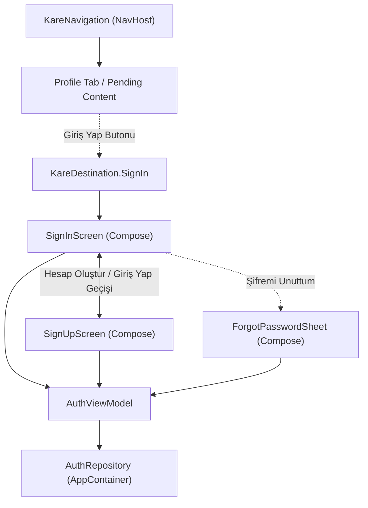

# Android Kimlik Doğrulama Arayüzü ve Navigasyon (Plan A) Uygulama Planı

## Hedef Açıklaması
Auth Foundation aşamasında tamamlanan Domain ve ViewModel katmanını (`AuthRepository`, `AuthViewModel`, `AuthUiState`) görsel arayüzle buluşturmak.

Bu aşamada:
- Kullanıcıların e-posta ve şifre ile giriş yapabileceği (**Giriş Yap / Sign In**),
- Yeni hesap oluşturabileceği (**Kayıt Ol / Sign Up**),
- Şifresini unuttuğunda sıfırlama bağlantısı isteyebileceği (**Şifremi Unuttum / Reset Password**),
- Kare tasarım sistemine (%100 KareColors, KareTypography, yumuşak yüzeyler, Fraunces serif başlıklar) uygun **Jetpack Compose** ekranları geliştirilecektir.
- Türkçe ve İngilizce string kaynakları tanımlanacak,
- `AppContainer` ve `KareNavigation` bileşenlerine Auth rotaları ve ViewModel enjeksiyonu eklenecektir.

---

## Kullanıcı İncelemesi ve Onayı Gereken Kritik Noktalar

> [!IMPORTANT]
> **Branch ve Çalışma Düzeni**:
> - En son `origin/ANDROID` (PR #1 birleştirilmiş hali) temel alınarak yeni bir özellik dalı oluşturulacak: `android/auth-ui`.
> - Bu aşamada `AppContainer.kt` ve `KareNavigation.kt` dosyalarına yeni bağımlılıklar ve rotalar ekleneceği için kontrollü ve minimum müdahale ile çalışılacaktır.

> [!NOTE]
> **Tasarım Dili (Design Parity)**:
> - Ekranlar sıradan Material 3 yerine, Kare'nin warm paletini (`KareColors.WarmSurface`, `KareColors.CoralAccent`), `Fraunces` başlık fontunu ve zarif mikro animasyonlarını kullanacaktır.
> - Form alanlarında anlık hata geri bildirimleri ve şifre gizle/göster kontrolleri bulunacaktır.

---

## Mimari Akış



---

## Yapılacak Değişiklikler

### 1. Bileşen: Compose Kimlik Doğrulama Ekranları (`feature/auth/`)

#### [YENİ] `feature/auth/AuthComponents.kt`
- Yeniden kullanılabilir form elemanları:
  - `AuthTextField`: E-posta ve ad-soyad için özel dolgulu, yuvarlatılmış ve odaklanma renkli metin alanı.
  - `PasswordTextField`: Şifre gizleme/gösterme ikonlu güvenli metin alanı.
  - `AuthButton`: Yükleme esnasında dönen gösterge (`CircularProgressIndicator`) içeren Kare mercan renkli ana eylem butonu.
  - `AuthErrorBanner`: Semantik `AuthError` koduna karşılık gelen hata mesajını animasyonlu gösteren uyarı şeridi.

#### [YENİ] `feature/auth/SignInScreen.kt`
- Giriş Yap ekranı:
  - Başlık: "Tekrar Hoş Geldiniz" / "Welcome Back" (`Fraunces` tipografi).
  - E-posta ve şifre giriş alanları.
  - "Şifremi Unuttum?" bağlantısı.
  - "Giriş Yap" butonu (yükleme durumunda kilitli ve animasyonlu).
  - "Hesabın yok mu? Kayıt Ol" geçiş bağlantısı.

#### [YENİ] `feature/auth/SignUpScreen.kt`
- Kayıt Ol ekranı:
  - Başlık: "Hesap Oluştur" / "Create Account".
  - Ad-Soyad, E-posta ve Şifre alanları.
  - Şifre gereksinim ipucu (en az 6 karakter).
  - "Kayıt Ol" butonu.
  - "Zaten hesabın var mı? Giriş Yap" geçiş bağlantısı.

#### [YENİ] `feature/auth/ForgotPasswordDialog.kt`
- Şifre sıfırlama modal bottom sheet veya dialog bileşeni:
  - E-posta girişi, sıfırlama bağlantısı gönderme butonu ve başarı bilgilendirmesi.

---

### 2. Bileşen: Yerelleştirme / Strings (`res/values/`)

#### [YENİ] `app/src/main/res/values/auth_strings.xml` (İngilizce)
```xml
<resources>
    <string name="auth_sign_in_title">Welcome Back</string>
    <string name="auth_sign_in_subtitle">Sign in to sync your widgets and reviews</string>
    <string name="auth_sign_up_title">Create Account</string>
    <string name="auth_sign_up_subtitle">Join Kare to customize and share widgets</string>
    <string name="auth_email_label">Email</string>
    <string name="auth_password_label">Password</string>
    <string name="auth_name_label">Name</string>
    <string name="auth_sign_in_action">Sign In</string>
    <string name="auth_sign_up_action">Create Account</string>
    <string name="auth_forgot_password_action">Forgot Password?</string>
    <string name="auth_no_account_prompt">Don\'t have an account? Sign Up</string>
    <string name="auth_have_account_prompt">Already have an account? Sign In</string>
    <string name="auth_reset_password_title">Reset Password</string>
    <string name="auth_reset_password_desc">Enter your email and we\'ll send you a link to reset your password.</string>
    <string name="auth_send_reset_link">Send Reset Link</string>
    <string name="auth_reset_link_sent">Password reset email sent. Check your inbox.</string>
    
    <!-- Semantik Hatalar -->
    <string name="auth_error_invalid_credentials">Email or password is wrong.</string>
    <string name="auth_error_email_already_in_use">That email already has an account. Try logging in.</string>
    <string name="auth_error_weak_password">Pick a longer password, at least 6 characters.</string>
    <string name="auth_error_user_not_found">No account found with this email.</string>
    <string name="auth_error_user_disabled">This account has been disabled.</string>
    <string name="auth_error_too_many_requests">Too many attempts. Wait a minute and try again.</string>
    <string name="auth_error_network">No connection. Check your internet and try again.</string>
    <string name="auth_error_unavailable">Accounts aren\'t available right now. Try again later.</string>
    <string name="auth_error_invalid_input">Please fill in all required fields.</string>
    <string name="auth_error_unexpected">Something went wrong. Please try again.</string>
</resources>
```

#### [YENİ] `app/src/main/res/values-tr/auth_strings.xml` (Türkçe)
- Yukarıdaki stringlerin birebir Türkçe karşılıkları (Kare'nin mevcut Türkçe dil standardına uygun).

---

### 3. Bileşen: Uygulama Wiring & Navigasyon (`app/` ve `navigation/`)

#### [DEĞİŞTİR] `app/src/main/java/com/example/kare/app/AppContainer.kt`
- `val auth: AuthRepository by lazy { ... }` eklenmesi (başlangıçta session'ı hafızada tutan in-memory implementasyon).
- `KareViewModelFactory` içine `AuthViewModel` kaydının eklenmesi:
  ```kotlin
  AuthViewModel::class.java -> AuthViewModel(auth, errors)
  ```

#### [DEĞİŞTİR] `app/src/main/java/com/example/kare/navigation/KareNavigation.kt`
- Hedefler (`KareDestination`) arasına `SignIn` ve `SignUp` rotalarının eklenmesi:
  ```kotlin
  @Serializable data object SignIn : KareDestination
  @Serializable data object SignUp : KareDestination
  ```
- `NavHost` içine `SignInRoute` ve `SignUpRoute` composable'larının tanımlanması.
- Profil sekmesinde oturum açılmamışsa "Giriş Yap" butonunun kullanıcıyı `SignIn` rotasına yönlendirmesi.

---

### 4. Bileşen: Testler (`app/src/test/java/...`)

#### [YENİ] `app/src/test/java/com/example/kare/feature/auth/AuthScreensTest.kt`
- Robolectric / Compose UI testleri:
  - Giriş ekranında alanların render edilmesi ve metin girişi.
  - Hatalı girişte `AuthErrorBanner` görünürlüğü.
  - Kayıt Ol ekranına geçiş (`navigation`).
  - Şifre sıfırlama iletişim kutusu etkileşimi.

---

## Doğrulama ve Güvenlik Adımları

1. `./gradlew assembleDebug`
2. `./gradlew test` (tüm birim ve UI testlerinin sıfır hatayla geçmesi)
3. `git diff --check`
4. Yeni faz dokümantasyonunun (`docs/AUTH_MIGRATION_NOTES.md`) güncellenmesi.
